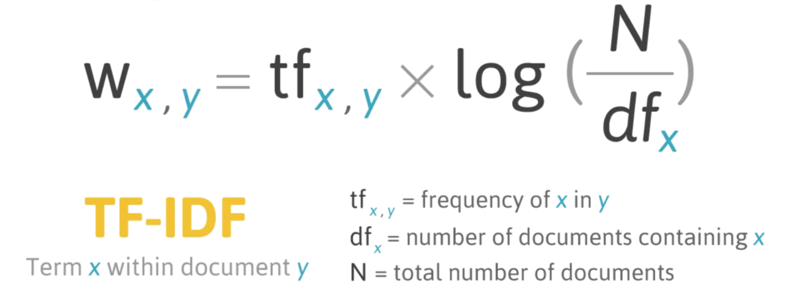
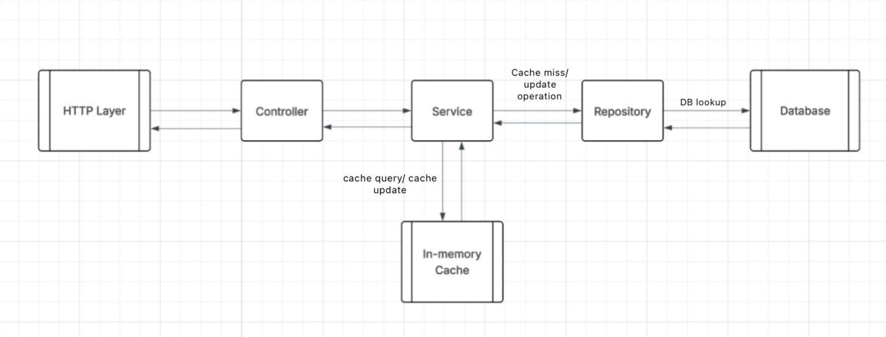

# Lexical Retriever 
A lightweight C++-based document retrieval system implementing TF-IDF with caching and database persistence.

### System Overview:

A lexical retriever is essentially a token-based search system that finds and returns the most relevant documents from the database. 
It uses TF-IDF scoring to rank results and supports CRUD operations on documents via their document IDs. 
For efficient and fast retrieval, it employs an inverted index to tokenize and store words in the database. 
Further speed-up is achieved by periodically running a background thread for IDF computation - since IDF uses a logarithmic scale, it does not require continuous updates.

### TF-IDF score:



### System Architecture

The architecture is organized into three hierarchical layers. Each incoming request passes through the following components:

1. HTTP Layer
Using the CivetWeb library, all client requests are handled through exposed REST API endpoints that support CRUD operations on documents.

2. In-Memory Cache Layer
For fast storage and retrieval, a cache layer maintains recently accessed documents and word term frequencies. It acts as a lookaside cache, reducing the need for repeated database access.

3. Persistent Storage Layer (Database)
Responsible for permanently storing documents and the inverted index (i.e., the term frequency table) in PostgreSQL.

### Request Flow Architecture



### Implementation Details

1. The system follows an MVC architecture, where each incoming request is routed to the appropriate controller, service, and repository layers to ensure clear separation of logic and maintainability.

2. The cache is implemented in C++ using a combination of a doubly linked list and a map, enabling constant-time insertions, lookups, and evictions based on the LRU policy.

3. Threading and synchronization are handled using pthreads and mutex locks to ensure thread safety during concurrent cache or database operations.

4. Database connectivity is managed through the libpq-fe library for PostgreSQL, providing efficient and reliable communication with the persistent storage layer.

### Database Design

The database has two main tables designed for document storage and term-based retrieval:

1. `documents` Table
Stores each document with a unique doc_id, the full document_text, and a created_at timestamp. It acts as the main storage for all documents.

2. `term_frequency` Table
Stores tokenized words from each document along with their normalized word_frequency. The combination of doc_id and word forms the primary key.
An index on word is created to quickly find all documents containing a specific term.

### In-memory Storage layer Design

- The system has two separate LRU caches, one for documents and another for term frequencies, to reduce database queries and improve response time.
- Both caches are implemented in C++ using a map and a doubly linked list for quick lookups and evictions.
Thread safety is handled using pthread locks since multiple requests can access the cache at the same time.
- The cache sizes are configurable through environment variables.
- The document cache stores document text using doc_id, while the term frequency cache stores a list of (doc_id, term_frequency) pairs for each word.
- A CacheManager class manages both caches as singletons so that they can be accessed anywhere in the system.
- When a document is deleted, the entire cache is cleared because removing all related word entries individually is not efficient.

### Request flows

### Supported Requests


| Request Name      | URL Endpoint                  | Flow                                                                                     | Type of Bound |
|-------------------|------------------------------|------------------------------------------------------------------------------------------|----------------|
| Create Document   | `/document` (POST)           | HTTP → Controller → Tokenization → Cache (update) → Database insert                      | I/O Bound      |
| Retrieve Document | `/document/:id` (GET)        | HTTP → Controller → Cache lookup → (DB if miss) → Return response                        | I/O Bound (Cache miss) |
| Search Query      | `/search?q=<query>` (GET)    | HTTP → Controller → Cache lookup → (DB if miss) → Score computation → Return response     | CPU Bound      |
| Delete Document   | `/document/:id` (DELETE)     | HTTP → Controller → Database delete → Cache flush                                        | I/O Bound      |


### Background Thread Handling

A separate background thread is responsible for computing and updating the IDF values periodically. It runs independently of user requests, ensuring that write or search operations are not blocked. The thread safely updates shared data using locks where required, and this design helps keep query latency low while maintaining consistency of the TF-IDF score.

### How to Start Server

#### 1. Environment Setup
A sample environment file `.env.sample` is provided in the project root.  
Copy it to `.env` and update the values as per your local configuration:

```bash
cp .env.sample .env
```

#### 2. Database Initialization
The database schema and indexes can be created using the query.txt file provided in the repo.
Run the script directly on PostgreSQL:
```bash
psql -U <username> -d <dbname> -f query.txt
``` 

#### 3. Build the Project
The project uses CMake for building. From the root directory, run:
```bash
mkdir build && cd build
cmake ..
make
```

#### 4. Start the server
Once the build is complete, start the server executable:
```bash
./server
```